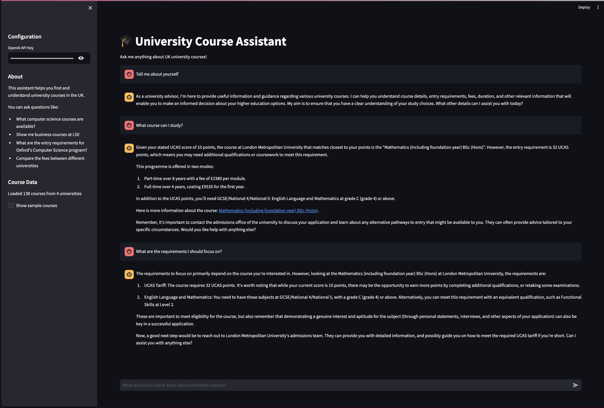

# University Course Assistant

A chatbot application that helps users find and understand university courses based on their requirements and preferences.



## Project Structure

```
.
├── app/                    # Application interfaces (CLI and Web)
├── core/                   # Core functionality
│   ├── data_loader.py     # Data loading and processing
│   ├── intent_parser.py   # User query interpretation
│   ├── response_generator.py # Response generation
│   ├── memory.py          # Conversation history management
│   └── course_filter.py   # Course filtering logic
├── config/                 # Configuration files
├── data/                   # Course data
│   ├── clean_structured_example.json  # Example structured data for demo
│   └── ...                # Other data files
├── utils/                  # Utility functions
│   └── data_collector.py  # Data collection from external API
├── requirements.txt        # Project dependencies
└── run.py                 # Main entry point
```

## Data Collection and Processing

### Data Source Selection

For this project, we evaluated several university comparison platforms as potential data sources:

| Platform | Website | Strengths | Account Needed? |
|----------|---------|-----------|-----------------|
| The Complete University Guide | https://www.thecompleteuniversityguide.co.uk | Rankings by subject, entry requirements, fees, student satisfaction | Not needed |
| WhatUni | https://www.whatuni.com | Filters by subject/location, student reviews, course modules | Not needed for most data, but only for 'Get prospectus' |
| **UniversityCompare** | https://www.universitycompare.com | Student decision-making focus, smooth comparison UX, clear course data | Yes, account needed for advanced features |
| The Guardian University Guide | https://www.theguardian.com/education/universityguide | University rankings, score breakdowns (teaching quality, etc.) | Not needed |
| Discover Uni (UK Gov) | https://www.discoveruni.gov.uk | Official statistics: satisfaction, employment, salary, etc. | Not needed |

**UniversityCompare was selected as the primary data source** for the following reasons:

1. **API Accessibility**: 
   - The platform exposes a GraphQL API that can be accessed through network requests
   - This allows for structured data retrieval without complex web scraping
   - The API provides comprehensive course information in a consistent format

2. **Data Quality**:
   - The data structure is clean and consistent
   - Course information is well-organized and includes all necessary fields
   - The platform focuses on student decision-making, aligning with our chatbot's purpose

3. **Development Efficiency**:
   - Using the API significantly reduced development time compared to web scraping
   - The consistent data format minimized the need for extensive data cleaning
   - The API provides all required fields (course details, fees, entry requirements) in a single request

4. **Alternative Limitations**:
   - Other platforms would require manual web scraping
   - Each platform would need custom scraping logic and data cleaning
   - Data segmentation would vary by provider, requiring additional processing
   - Some platforms have anti-scraping measures that would complicate data collection

While UniversityCompare provides excellent data for this demonstration, a production system would ideally aggregate data from multiple sources to provide more comprehensive information. This would require significant additional development to handle the varying data structures and formats from different providers.

### Data Collection (`utils/data_collector.py`)

The application collects university course data from external sources using an asynchronous data collection process:

1. **API Integration**:
   - Connects to the UniversityCompare GraphQL API
   - Uses asynchronous HTTP requests for efficient data retrieval
   - Implements rate limiting and retry mechanisms

2. **Data Collection Process**:
   - **Universities**: Fetches all universities with pagination
   - **Courses**: Retrieves courses for each university in parallel
   - **Course Details**: Gathers detailed information for each course
   - **Structured Dataset**: Creates a normalized dataset for the chatbot

3. **Performance Optimizations**:
   - Concurrent requests with semaphore control (max 50 concurrent requests)
   - Batch processing for course details (100 courses per batch)
   - Exponential backoff for retry logic
   - Progress tracking with tqdm

4. **Data Storage**:
   - Saves raw data to JSON files:
     - `universities.json`: List of all universities
     - `courses.json`: Basic course information
     - `course_details.json`: Detailed course data
     - `structured_dataset.json`: Normalized dataset for the chatbot

### Data Processing

The application processes university course data in the following way:

1. **Data Loading**: 
   - Course data is loaded from JSON files in the `data/` directory
   - The data is flattened and transformed into a pandas DataFrame
   - Each course entry contains information about:
     - Course name and ID
     - University details
     - Study options (mode, duration, start dates)
     - Entry requirements
     - Fees
     - Campus information

2. **Data Processing**:
   - Course data is normalized and cleaned
   - Fees are standardized by region
   - Entry requirements are formatted for easy comparison
   - Study options are expanded into separate entries

## AI Architecture and Functionality

### How the AI Works

The chatbot uses a sophisticated multi-stage pipeline to process user queries and generate relevant responses:

1. **Intent Parsing (`core/intent_parser.py`)**:
   - Uses GPT-4 to analyze the user's query and extract key information
   - Identifies search parameters such as:
     - Subject area (e.g., "computer science", "engineering")
     - Location (e.g., "London", "Manchester")
     - Study mode (e.g., "full-time", "part-time")
     - Duration (e.g., "3 years", "4 years")
     - Start date (e.g., "September", "January")
     - Entry requirements (e.g., "UCAS points", "A-levels")
   - Structures the parsed intent into a standardized format for filtering

2. **Course Filtering (`core/course_filter.py`)**:
   - Applies the parsed intent to filter the course database
   - Uses pandas DataFrame operations for efficient filtering
   - Implements fuzzy matching for subject areas and locations
   - Ranks results by relevance to the user's query
   - Returns a subset of courses that best match the user's requirements

3. **Response Generation (`core/response_generator.py`)**:
   - Takes the filtered courses and parsed intent
   - Constructs a detailed prompt for GPT-4 with:
     - System instructions for response format
     - Available courses with their details
     - Parsed user intent
     - Conversation history for context
   - Generates a natural language response that:
     - Summarizes the matching courses
     - Highlights key information (fees, entry requirements, etc.)
     - Provides relevant links to university pages
     - Answers specific questions about the courses

4. **Conversation Memory (`core/memory.py`)**:
   - Maintains a history of the conversation
   - Allows the AI to reference previous queries and responses
   - Enables follow-up questions and clarifications
   - Provides context for more natural interactions

### How the AI Responds to Questions

The AI processes user questions through the following workflow:

1. **Query Reception**:
   - User submits a question through the CLI or web interface
   - The question is sent to the intent parser

2. **Intent Analysis**:
   - GPT-4 analyzes the question to understand the user's intent
   - Extracts key parameters and requirements
   - Determines if the question is about:
     - Finding specific courses
     - Comparing courses
     - Getting information about entry requirements
     - Understanding fees and funding
     - Other course-related information

3. **Course Matching**:
   - The parsed intent is used to filter the course database
   - Courses that match the user's requirements are identified
   - Results are ranked by relevance

4. **Response Creation**:
   - GPT-4 generates a natural language response based on:
     - The matched courses
     - The user's specific question
     - The conversation history
   - The response is formatted to be informative and easy to understand

5. **Response Delivery**:
   - The generated response is sent back to the user
   - In the web interface, course links are made clickable
   - The conversation history is updated for future context

### Limitations and Constraints

As a demonstration project, the current implementation has several limitations:

1. **Data Volume Constraints**:
   - The full dataset contains over 26,000 course records
   - Due to token limits in GPT-4's context window, only a subset of courses can be included in each prompt
   - For demonstration purposes, we limit the number of courses sent to the AI to ensure reliable responses
   - In a production environment, this would be addressed through:
     - More sophisticated course filtering
     - Pagination of results
     - Database integration instead of in-memory processing

2. **Computational Limitations**:
   - The current implementation runs on CPU rather than GPU
   - This limits the speed and scale of processing, especially for large datasets
   - In a production environment, this would be optimized with:
     - GPU acceleration
     - Distributed processing
     - Caching of common queries

3. **API Constraints**:
   - The OpenAI API has rate limits and usage costs
   - Each query requires multiple API calls (intent parsing and response generation)
   - This limits the number of queries that can be processed in a given time period
   - In a production environment, this would be addressed through:
     - Caching of common responses
     - Batch processing of similar queries
     - Fallback mechanisms for when the API is unavailable

4. **Scope Limitations**:
   - The current implementation focuses on undergraduate courses
   - Postgraduate courses and other educational programs are not included
   - The system is designed for the UK higher education system
   - International courses and institutions are not covered

5. **Accuracy Considerations**:
   - The AI's responses are based on the data available in the dataset
   - If the data is incomplete or outdated, the responses may be inaccurate
   - The system does not have real-time access to university websites
   - Users should verify information directly with universities

6. **Data Source Limitations**:
   - The system relies solely on UniversityCompare data
   - Other platforms may offer additional information not available in our dataset
   - The data may not include the most recent updates from universities
   - Some specialized courses or newer programs might be underrepresented

## Running the Application

### Prerequisites

- Python 3.8 or higher
- OpenAI API key (set as environment variable: `OPENAI_API_KEY`)
- Make (for using the Makefile commands)

### Installation

The application uses a virtual environment to manage dependencies and avoid conflicts with system Python packages. Follow these steps to install:

1. Clone the repository:
   ```bash
   git clone <repository-url>
   cd university-course-assistant
   ```

2. Install dependencies using the Makefile:
   ```bash
   make install
   ```
   This will:
   - Create a virtual environment in the `venv` directory (if it doesn't exist)
   - Upgrade pip to the latest version
   - Install all required dependencies in the virtual environment

3. Set up your environment variables:
   Create a `.env` file in the project root with:
   ```
   OPENAI_API_KEY=your_api_key_here
   ```

### Troubleshooting

If you encounter any issues during installation:

1. **"externally-managed-environment" error**:
   - This error occurs when trying to install packages in a system Python environment
   - Solution: Make sure you're using the virtual environment by running `make install`
   - The Makefile will automatically create and use the virtual environment

2. **Missing dependencies**:
   - If you see "ModuleNotFoundError", try running `make clean` followed by `make install`
   - This will remove the virtual environment and create a fresh one with all dependencies

3. **Permission issues**:
   - If you get permission errors, try running:
     ```bash
     sudo make clean
     make install
     ```

4. **Python version issues**:
   - Ensure you have Python 3.8 or higher installed
   - Check your Python version with: `python3 --version`
   - If needed, install the correct Python version using your system's package manager

5. **Levenshtein installation issues**:
   - If you encounter errors related to building the Levenshtein package (especially on macOS with Python 3.13+), try:
     ```bash
     source venv/bin/activate
     pip install -r requirements.txt --no-deps fuzzywuzzy
     ```
   - This will install fuzzywuzzy without its problematic Levenshtein dependency
   - The project already includes python-Levenshtein in requirements.txt, which is the recommended alternative

### Usage

The application can be run in two modes:

1. **CLI Mode**:
   ```bash
   make run-cli
   ```

2. **Web Interface**:
   ```bash
   make run-web
   ```

All commands will automatically use the virtual environment, so you don't need to activate it manually.

### Data Collection

For demonstration purposes, the repository includes a pre-processed dataset (`data/clean_structured_example.json`) that contains a sample of 100 university courses. This allows you to run the application immediately without needing to collect data from the API.

If you want to collect fresh data from the UniversityCompare API:

```bash
make collect-data
```

This will run the data collector and update the JSON files in the `data/` directory.

## Interacting with the Chatbot

1. **CLI Mode**:
   - Type your questions directly in the terminal
   - Use natural language to describe your course requirements
   - Follow the prompts for additional information if needed

2. **Web Interface**:
   - Access the interface through your web browser
   - Use the chat interface to ask questions
   - View course details in a structured format
   - Click on course links to visit university pages

## Example Queries

- "Show me computer science courses in London"
- "What are the entry requirements for business courses?"
- "Find part-time engineering courses starting in September"
- "Compare fees for psychology courses across different universities"
